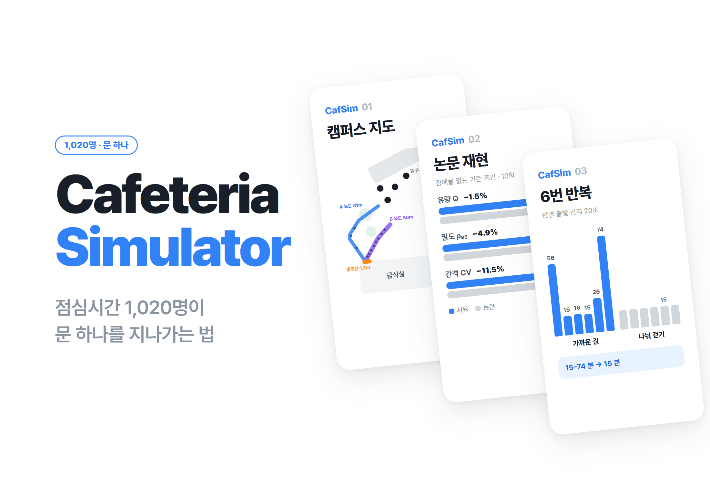
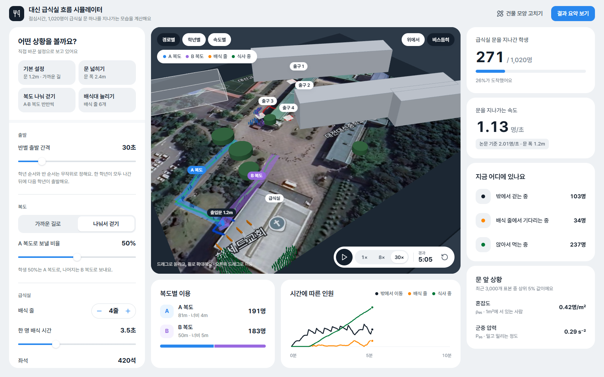
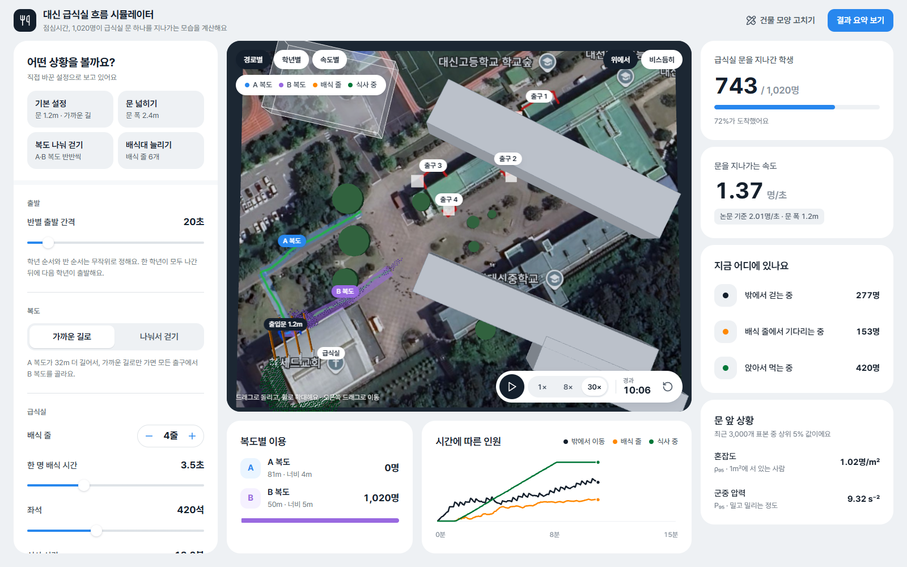
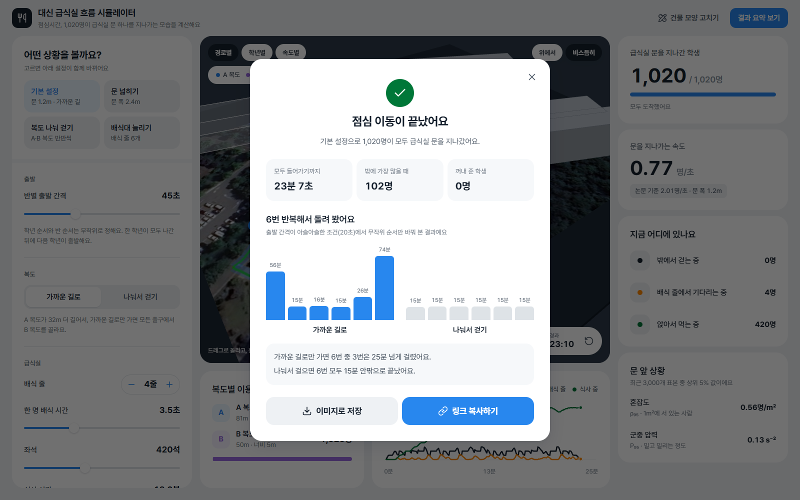
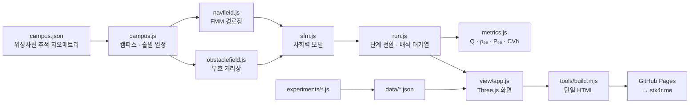

# CafeteriaSimulator

<p align="center"></p>

> 삼성 휴먼테크 논문에서 쓴 사회력 모델을 JavaScript로 다시 구현해 논문의 기준값을 재현하고 대전대신고 캠퍼스 전체로 넓혀 학생 1,020명이 급식실 문 하나를 지나가는 점심 이동을 계산하는 군중 시뮬레이터

---

## 1. 프로젝트 개요 (Overview)

| 항목 | 내용 |
|---|---|
| 프로젝트명 | CafeteriaSimulator (웹판 「대신 급식실 흐름 시뮬레이터」, 커밋 약칭 CafSim) |
| 한 줄 요약 | 논문이 바꿔 본 '문 앞 장애물' 대신 학교가 공사 없이 바꿀 수 있는 두 가지, 반별 출발 간격과 복도 배분을 달리해 가며 급식실 문 앞 병목을 계산한다 |
| 진행 기간 | 2026.09.10 ~ 2026.10.03 (v1.0.0 → v1.1.4) · 09.10 시뮬레이션 코어와 실험 · 10.03 웹 배포와 화면 개편 |
| 참여 인원 | 개인 프로젝트 |
| 본인 역할 | 사회력 모델과 경로장 구현, 논문 기준값 재현과 상수 보정, 캠퍼스 지오메트리 추적, 실험 설계, 3D 웹 앱 개발과 배포 |
| 기여도 | 100% (저장소 커밋 9건 전부 본인) |

삼성 휴먼테크 논문 「군중 유체 관점에서 분석한 학교 급식실 병목부 전방 장애물의 흐름 안정화 효과 분석」은 MATLAB으로 폭 6.0m 접근로가 1.2m 출입문으로 좁아지는 구간에 60명을 넣고 문 앞에 원기둥 장애물을 두었을 때 흐름이 어떻게 바뀌는지 봤다. 장애물의 크기·거리·위치를 바꿔 봤지만 처리량과 안전을 함께 개선하는 배치는 찾지 못했다.

이 저장소는 그 논문의 보조 자료다. 먼저 같은 모델을 JavaScript로 직접 구현해 논문 Table 1의 장애물 없는 기준값을 재현했다. 그다음 무대를 실제 캠퍼스로 넓혔다. 건물 출구 4곳에서 나온 학생이 광장을 건너 두 복도 중 하나를 지나 급식실 문 하나로 들어가고 배식 줄과 좌석까지 이어진다. 바꾸는 변수는 장애물이 아니라 학교가 규칙만으로 정할 수 있는 반별 출발 간격과 복도 배분이다.

## 2. 기술 스택 (Tech Stack)

| 구분 | 기술 | 선택 이유 |
|---|---|---|
| 군중 물리 | Vanilla JavaScript로 직접 구현한 Helbing–Farkas–Vicsek 사회력 모델 (공간 해시 이웃 탐색, 준암시적 오일러 적분) | 논문과 같은 모델이어야 기준값을 대조할 수 있다 |
| 길찾기 | 고속 행진법(FMM)으로 푼 아이코널 방정식 | 8방향 다익스트라는 방향 오차가 약 8%라 병목 근처 보행 방향이 틀어진다. FMM은 1% 아래다 |
| 벽 처리 | 막힌 격자에서 만든 부호 거리장과 법선 (Felzenszwalb–Huttenlocher 거리 변환) | 캠퍼스 규모에서는 보행자마다 벽 선분을 도는 계산이 비용 대부분을 차지했다. 거리장으로 바꾸면 배열 두 번 읽기로 끝난다 |
| 급식실 내부 | 대기열 모델 (배식 줄 + 좌석 체류) | 실내에서 답할 질문은 "문과 배식대 중 무엇이 병목인가"다. 힘 모델은 여기에 접촉 잡음만 더한다 |
| 렌더링 | Three.js r160 + 위성사진 지면 텍스처 | 캠퍼스를 3D로 보여 주되 물리 계산과는 분리했다 |
| 빌드 · 배포 | Node 빌드 스크립트로 단일 HTML(약 1.0MB) 번들 → GitHub Actions → GitHub Pages, stx4r.me Cloudflare Worker 프록시 | Three.js·코어·지오메트리·지면 텍스처를 모두 인라인해 몇 주 뒤에도 파일 하나로 열린다 |
| 실험 | Node 스크립트 4종 (`replicate` · `calibrate` · `sweep` · `bimodal`) | 시드를 고정한 난수(mulberry32)로 모든 실행을 다시 만들 수 있다 |

## 3. 핵심 기능 및 담당 업무 (Key Features & Contributions)

<p align="center"></p>
<p align="center">
  
  </p>
<p align="center"><sub>로컬 빌드에서 캡처. 위: 복도 나눠 걷기·출발 간격 30초, 5분 시점(A 복도 191명, B 복도 183명). 아래 왼쪽: 출발 간격 20초·가까운 길, 10분 시점을 위에서 본 모습(1,020명 전원이 B 복도로 몰리고 문 앞 군중 압력 P₉₅ 9.32). 아래 오른쪽: 기본 설정 결과 요약(23분 7초, 6회 반복 막대)</sub></p>

### 구현 기능

- **캠퍼스 3D 화면**: 위성사진 위에 건물·화단·두 복도·출입문을 올리고 학생 1,020명을 움직인다. 색은 경로별·학년별·속도별로 바꾸고 위에서 보기와 비스듬히 보기를 오간다.
- **상황 프리셋 4종**: 기본(문 1.2m·가까운 길) · 문 넓히기(2.4m) · 복도 나눠 걷기(A·B 반반) · 배식대 늘리기(6줄).
- **설정 슬라이더**: 반별 출발 간격, 경로 정책(가까운 길 / 나눠 걷기)과 A 복도 비율, 배식 줄 수, 한 명 배식 시간, 좌석 수, 식사 시간, 문 폭. 문 폭을 바꾸면 길찾기 지도를 다시 계산한다.
- **실시간 계기판**: 문을 지난 인원, 문 유량(논문 기준 2.01명/초와 나란히), 위치별 인원(밖·배식 줄·식사 중), 문 앞 혼잡도 ρ₉₅와 군중 압력 P₉₅, 시간별 인원 그래프, 복도별 이용 인원.
- **결과 요약**: 모두 들어가기까지 걸린 시간, 밖에 가장 많았을 때의 인원, 꺼내 준 학생 수와 함께 미리 계산한 6회 반복 결과를 막대로 보여 준다. 이미지로 저장할 수 있고 설정이 주소에 담겨 링크로 같은 조건을 공유한다(`?hw=45&route=split&a=50…`).
- **막힘 판정**: 모두 출발한 뒤 600초 동안 문을 지난 사람이 10명 미만이면 "문 앞이 막혀 버렸어요"로 끝내고 남은 인원을 알려 준다.
- **지오메트리 편집**: `campus.json`을 앱 안에서 고쳐 적용한다. 위성사진에서 바로 읽은 값과 저해상도 사진에서 추정한 값을 나눠 표시한다.

### 모델 구성과 핵심 수식

```
m dv/dt = m (v₀e − v)/τ + Σ f_ij + Σ f_iW
f_ij = [ A·exp((r_ij − d_ij)/B) + k·g(r_ij − d_ij) ] n_ij + κ·g(r_ij − d_ij)·(Δv_ji · t_ij) t_ij
e = −∇T/|∇T|,   |∇T| = 1   (아이코널, FMM)
ρ = N/A,   Q = (N − 1)/(t_N − t_1),   CV_h = s_h / h̄,   P = ρ·Var(v)
```

보행자 값은 논문을 그대로 따랐다(r 0.23m, m 75kg, v₀ 1.34 ± 0.12m/s, τ 0.5s, dt 0.03s). 논문이 적지 않은 힘 상수는 보정으로 정했다(A 3000N, B 0.055m, 접근로 8.0m). 캠퍼스 실행에서 보행자는 여섯 단계를 거친다.

| 단계 | 내용 | 모델 |
|---|---|---|
| 0 | 출구에서 배정된 복도 입구까지 | 사회력 |
| 1 | 복도를 따라 급식실 문까지 | 사회력 |
| 2 | 가장 짧은 배식 줄에서 대기 | 대기열 |
| 3 | 배식 (3.5초 × 0.75~1.25) | 대기열 |
| 4 | 식사 (780초 × 0.8~1.2) | 체류 |
| 5 | 퇴장 | — |

### 주요 업무

- 사회력 모델·공간 해시·적분기를 직접 구현하고 논문 시나리오(6.0m → 1.2m, 60명)를 재구성
- 논문 Table 1 기준값 재현과 논문에 없는 상수의 격자 스캔
- 위성사진 위 캠퍼스 지오메트리 추적 (Google Earth 60m 축척 막대 = 372px → 0.1613m/px, 주차칸 간격 2.3m = 14.46px로 교차 확인)
- 출발 간격 × 복도 배분 실험 설계, 갈림이 큰 조건은 시드별 전수 실행
- Three.js 3D 앱, 단일 HTML 빌드, GitHub Pages 자동 배포

## 4. 성과 및 결과 (Results & Metrics)

### 정량적 성과

**논문 기준값 재현** (장애물 없음, 시드 10개, 2026.10 재실행)

| 지표 | 시뮬레이션 | 논문 Table 1 | 차이 | 95% 신뢰구간 |
|---|---|---|---|---|
| 유량 Q (명/s) | 1.979 ± 0.061 | 2.008 ± 0.040 | −1.5% | 겹침 |
| 밀도 ρ₉₅ (명/m²) | 2.870 ± 0.074 | 3.017 ± 0.014 | −4.9% | 안 겹침 |
| 간격 변동 CV_h | 0.542 ± 0.035 | 0.612 ± 0.032 | −11.5% | 안 겹침 |
| 압력 P₉₅ (s⁻², 구역 평균) | 0.934 | 1.431 ± 0.047 | −34.7% | 정의 차이 |
| 압력 P₉₅ (s⁻², 국소장) | 1.803 ± 0.063 | 1.431 ± 0.047 | +26.0% | 정의 차이 |

보정 전 기본 상수(A 2000N, B 0.08m)로는 Q가 −15.5%, CV_h가 +26.5% 벗어났다.

**출발 간격 × 복도 배분** (시드 3개 평균, `data/sweep.json`)

| 출발 간격 | 경로 | 문 유량 Q (명/s) | 간격 CV_h | P₉₅ (s⁻²) | 마지막 배식까지 (s) | 밖 최대 인원 |
|---|---|---|---|---|---|---|
| 20초 | 가까운 길 | 0.886 | 8.27 | 8.40 | 1,749 ± 1,577 | 300 |
| 20초 | A 30% | 0.912 | 7.17 | 7.76 | 1,317 ± 632 | 295 |
| 20초 | **A 50%** | **1.211** | **1.34** | 8.52 | **916 ± 9** | 291 |
| 30초 | 가까운 길 | 1.116 | 3.09 | 0.11 | 982 ± 30 | 136 |
| 30초 | A 30% | 1.095 | 2.10 | 0.22 | 997 ± 17 | 137 |
| 30초 | A 50% | 1.104 | 1.94 | 0.24 | 997 ± 29 | 139 |
| 45초 | 가까운 길 | 0.752 | 3.71 | 0.08 | 1,427 ± 31 | 102 |
| 45초 | A 30% | 0.746 | 2.82 | 0.17 | 1,431 ± 25 | 102 |
| 45초 | A 50% | 0.747 | 2.64 | 0.19 | 1,434 ± 24 | 103 |

가까운 길을 고르면 A 복도가 32m 더 길어서 네 출구 모두 B 복도를 쓴다(A 비율 0%).

**출발 간격 20초, 시드 6개 전수** (`data/bimodal.json`)

| 경로 | 마지막 배식까지 (s), 시드 1~6 | 범위 |
|---|---|---|
| 가까운 길 | 3,358 · 921 · 968 · 906 · 1,577 · 4,415 | 906 ~ 4,415 |
| A 50% | 906 · 920 · 921 · 920 · 921 · 922 | 906 ~ 922 |

| 항목 | 결과 |
|---|---|
| 규모 | 코어·실험 JS 1,765줄, 앱 JS 1,037줄 + HTML·CSS 574줄 |
| 빌드 결과 | `dist/simulator.html` 1.0MB |
| 실제 급식실 측정값과의 대조 | (확인 필요) |
| 논문 심사 결과 | (확인 필요) |

### 정성적 성과

- **논문이 정하지 않은 설정을 데이터로 좁혔다.** 힘 상수와 접근로 길이는 밀집도를 좌우하는데 논문에 없다. 가정하는 대신 격자 스캔으로 Table 1에 가장 가까운 조합을 찾았고 그 결과가 곧 "논문이 실제로 쓴 설정"의 추정이 됐다.
- **압력 지표의 정의 차이를 드러냈다.** 논문은 ρ를 구역 평균으로 정의하면서 P는 Helbing(2007)을 인용한다. 두 방식으로 모두 계산하니 구역 평균 0.934, 국소장 1.803이 나왔고 논문값 1.431은 그 사이에 있다. P₉₅를 비교하려면 정의부터 맞춰야 한다.
- **복도를 나누는 효과는 평균이 아니라 꼬리에서 나온다.** 출발 간격 30·45초에서는 마지막 배식 시각이 거의 같다(982 대 997초, 1,427 대 1,434초). 차이는 간격이 빠듯한 20초에서만 생긴다. 가까운 길은 6번 중 3번이 25분을 넘겼고 반반으로 나누면 6번 모두 15분 6초~15분 22초에 끝났다. 다만 문 앞 군중 압력 P₉₅는 8.40과 8.52로 비슷하다. 나누기는 문 앞을 덜 붐비게 하지 않는다. 막힘이 굳어 버리는 경우를 없앨 뿐이다.
- **바꿀 수 있는 변수를 골랐다.** 논문의 장애물은 시설 공사가 필요하다. 출발 간격과 복도 배분은 안내 규칙만으로 바꿀 수 있다.

### 확인된 한계

- **재현 지표 중 Q만 신뢰구간 안에 들어온다.** ρ₉₅는 −4.9%, CV_h는 −11.5%로 구간을 벗어난다. 저장소 README에는 오차가 2.4 / 6.8 / 6.5% 이내라고 적혀 있지만 현재 코드로 다시 돌리면 CV_h 오차가 11.5%다. `calibrate.js`를 지금 돌리면 최적값이 접근로 6.5m·B 0.05m로 나와 `calibration.json`의 8.0m·0.055m와도 다르다. B 0.055는 스캔 격자(0.05 / 0.08 / 0.12 / 0.16)에 없는 값이라 보정값의 출처를 다시 확인해야 한다.
- **건물 윤곽이 가장 약한 입력이다.** 출구·두 복도·출입문 위치는 주석이 달린 위성사진에서 직접 읽어 믿을 만하다. 건물 윤곽·운동장 경계·복도 너비는 저해상도 사진에서 추정했다. 문 폭 1.2m는 실측하지 않고 논문의 W를 그대로 썼다.
- **급식실 내부 값은 문헌 기본값이다.** 배식 줄 4개, 1인 3.5초, 좌석 420석, 식사 13분 모두 실측으로 바꿔야 한다.
- **사회력 모델은 한번 굳은 막힘을 스스로 풀지 못한다.** 문 앞에서 아치가 생기면 풀리지 않는다. 그래서 오래 혼자 끼어 있는 사람은 문 안으로 옮기고 그 수를 결과에 보고한다. 출발 간격 20초 조건에서는 실행마다 1~4명이 나왔다.
- **교사 100명은 아직 움직이지 않는다.** `campus.json`에 교사 수가 있고 보행자 용량도 잡혀 있지만 실행 총원은 학생 1,020명이다.
- **sweep 데이터가 일부만 있다.** `sweep.js`는 출발 간격 60·90초도 정의하지만 `data/sweep.json`에는 20·30·45초만 들어 있다. 조건마다 시드도 3개뿐이다.

## 5. 트러블슈팅 경험 (Troubleshooting)

### ① 논문에 없는 상수 때문에 기준값이 맞지 않았다

**문제** 논문 시나리오를 그대로 옮겨도 Helbing 기본 상수(A 2000N, B 0.08m)로 돌리면 유량 Q가 1.697명/s로 논문보다 15.5% 낮고 간격 변동 CV_h는 26.5% 높다.

**원인** 논문은 반지름·질량·희망 속도·반응 시간·시간 간격·문 폭·접근로 폭은 적었지만 힘 상수 A·B와 접근로 길이는 적지 않았다. 이 세 값이 문 앞 밀집도를 정하고 밀집도가 네 지표를 모두 움직인다.

**해결** 값을 하나 골라 가정하지 않고 스캔했다. 접근로 4종 × A 3종 × B 4종, 48조합을 시드 5개로 돌리고 논문 신뢰구간 안에 든 지표 수와 정규화 오차로 순위를 매겼다. 압력 P는 정의가 모호해서 구역 평균과 국소장 두 방식으로 함께 기록했다.

**결과** A 3000N, B 0.055m, 접근로 8.0m에서 Q 오차가 −1.5%로 줄었다. 그래도 ρ₉₅와 CV_h는 신뢰구간 밖에 남았다(확인된 한계 참고).

### ② 한 반 34명을 한꺼번에 내보내니 출구 하나가 통째로 갇혔다

**문제** 반이 출발할 때 34명을 출구 앞 생성 상자에 동시에 놓자, 출구 하나에 배정된 인원 전체가 움직이지 못했다.

**원인** 상자 안 밀도가 약 7명/m²가 돼 접촉력이 겹침을 풀지 못했다. 실제로는 34명이 교실 문 하나로 줄지어 나오니 동시 생성은 물리적으로 있을 수 없는 초기 상태다.

**해결** 출발한 반을 대기열에 넣고 출구마다 초당 2명씩 내보냈다. 내보낼 때는 다른 사람과 0.6m 이상 떨어진 자리를 최대 12번 찾고 없으면 다음 스텝으로 미룬다.

**결과** 출발 간격 30·45초 조건 18회 실행에서 고립 인원 0명, 완료율 1.000이 나왔다.

### ③ 멈춘 사람이 줄 선 사람인지 끼인 사람인지 가려야 했다

**문제** 몇 명이 문 앞 합류부의 벽에 끼어 끝내 도착하지 못했다. 그러면 완료율 지표가 의미를 잃는다.

**원인** 복도의 경로장 기울기가 건물 안쪽을 가리키는 구석이 있어 거기 들어간 사람은 벽을 미는 채로 멈춘다. 그런데 문 앞에서 줄 선 사람도 똑같이 멈춰 있다. 속도만으로는 둘을 구분할 수 없다.

**해결** 이웃 수로 갈랐다. 2.5m 안에 다른 보행자가 3명 이상이면 줄 서는 중으로 보고 넘어간다. 혼자 120초 넘게 멈춘 사람만 문 안으로 옮기고 그 수를 '꺼내 준 학생'으로 결과에 그대로 보고한다. 이 수가 작지 않다면 군중이 아니라 지오메트리가 틀렸다는 신호로 읽는다. 모델 안에서도 15초 넘게 멈춘 사람에게는 무작위 방향의 작은 힘을 줘 조금씩 움직이게 했다.

**결과** 출발 간격 30·45초에서는 꺼내 준 학생이 0명, 20초에서는 실행마다 1~4명이었다.

### ④ ±1,577초라는 신뢰구간은 잡음이 아니었다

**문제** 출발 간격 20초·가까운 길 조건의 마지막 배식 시각이 1,749 ± 1,577초로 나왔다. 평균이 의미가 없을 만큼 퍼졌다.

**원인** 결과가 두 갈래로 갈린다. 15분 안팎에 끝나거나, 문 앞 합류부에 막힘이 생겨 회복하지 못하고 수천 초를 끈다. 시드 3개의 평균은 두 모드를 섞어 버린다.

**해결** 평균을 내지 않고 시드 6개를 모두 돌려 하나하나 보고하는 실험(`bimodal.js`)을 따로 만들었다. 앱 결과 화면에도 이 6개 막대를 그대로 넣었다.

**결과** 가까운 길은 906초부터 4,415초까지, 반반은 906초부터 922초까지 나왔다. "나눠 걸으면 평균이 줄어든다"가 아니라 "나눠 걸으면 막힘 꼬리가 사라진다"로 결론이 바뀌었다.

### ⑤ 막힌 실행에서는 결과 화면이 영원히 뜨지 않았다

**문제** 웹 앱은 전원이 문을 지나야 결과 화면을 열었다. 막힘이 생긴 조건에서는 그 순간이 오지 않아 화면이 '이동 중'에 머물렀다.

**원인** 완료 판정이 "모두 통과"뿐이었다. ④에서 본 것처럼 이 모델은 굳은 막힘을 스스로 풀지 못하니 끝나지 않는 실행이 생긴다.

**해결** v1.1.3에서 결과 상태를 '진행 중 · 완료 · 막힘' 셋으로 나눴다. 모든 반이 출발했는데 최근 600초 동안 문을 지난 사람이 10명 미만이면 막힘으로 판정한다. 막힘이면 아이콘을 주황 경고로 바꾸고 문 앞에 남은 인원과 함께 "이 조건에서는 모델이 막힘을 스스로 풀지 못해요"라고 알린다.

**결과** 어떤 설정에서도 결과 화면이 열린다. 막힘이 나도 "문 앞이 막혀 버렸어요"라는 제목과 문 앞에 남은 학생 수로 끝난다.

## 6. 링크 및 산출물 (Links & Deliverables)

| 구분 | 링크 |
|---|---|
| GitHub 저장소 | [stx4R/CafeteriaSimulator](https://github.com/stx4R/CafeteriaSimulator) (비공개) |
| 배포 URL | https://stx4r.me/project/CafeteriaSimulator/ |
| 실험 재현 | `node experiments/replicate.js` · `calibrate.js` · `sweep.js` · `bimodal.js` |
| 빌드 | `node tools/build.mjs` → `dist/simulator.html` |
| 원 논문 | 「군중 유체 관점에서 분석한 학교 급식실 병목부 전방 장애물의 흐름 안정화 효과 분석」 (삼성 휴먼테크 논문) |

### 구조



---

+++

## 고객여정지도 (Journey Map)

사용자는 점심 동선을 정하는 선생님이나 학생회다.

| 단계 | 사용자의 행동 | 사용자의 생각 | 도구의 대응 |
|---|---|---|---|
| 탐색 | 기본 설정을 그대로 재생한다 | "점심때 밖이 얼마나 붐비지?" | 23분 7초 동안 밖에 최대 102명, 문 유량이 논문 기준 2.01명/초 옆에 뜬다 |
| 발견 | 복도별 이용 카드를 본다 | "왜 A 복도는 아무도 안 쓰지?" | A 복도가 32m 더 길어 모든 출구가 B를 고른다는 안내가 나온다 |
| 비교 | 출발 간격을 20초로 줄이고 다시 돈다 | "빨리 내보내면 빨리 끝나겠지?" | 문 앞에 사람이 쌓이고 군중 압력이 9를 넘는다 |
| 확인 | 결과 요약의 6회 반복 막대를 본다 | "한 번 막힌 건 우연 아니야?" | 가까운 길은 15~74분, 나눠 걷기는 6번 모두 15분 안팎 |
| 공유 | 링크 복사하기를 누른다 | "회의 때 이 조건 그대로 보여 줘야지" | 설정이 담긴 주소가 복사된다 |

## 제스처링 (Gesturing)

- 3D 화면을 드래그해 돌리고 휠로 확대·축소하고 오른쪽 드래그로 옮긴다.
- 위에서 보기와 비스듬히 보기를 칩 하나로 오가며 시점이 부드럽게 바뀐다.

## 적응형 디자인 (Adaptive Design)

- 넓은 화면에서는 설정 · 지도 · 계기판 세 열로 놓는다.
- 폭 1,279px 이하에서는 설정과 지도를 두 열로 두고 계기판을 그 아래 한 줄 격자로 내린다.
- 899px 이하에서는 지도(화면 높이의 62%) → 계기판 → 설정 순서로 한 열에 쌓는다. 지도 위 범례·칩·재생 바도 겹치지 않게 다시 놓는다.
- 움직임 줄이기 설정을 켠 사용자에게는 전환 효과를 끈다.
