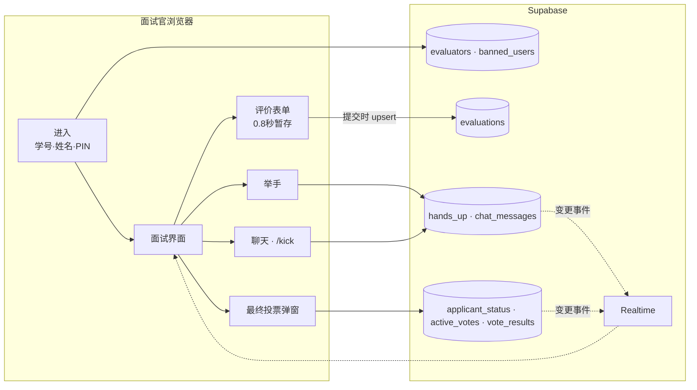

# L-INK Interview

<p align="center"></p>

> 让多位面试官在同一界面上进行社团新成员面试，并实时同步评分、提问顺序和录取投票的面试评价 Web 应用「L-INK Eval」

---

## 1. 项目概述 (Overview)

| 项目 | 内容 |
|---|---|
| 项目名称 | L-INK Interview（应用名「L-INK Eval」） |
| 一句话概述 | 把原本分散在各位面试官手里的申请表、评分、备注和录取意见集中到一处，并实时共享由谁提下一个问题以及最终的录取投票 |
| 进行时间 | 2026.03（仓库创建于2026.03.21，面试日期待确认）· 2026.07.20 将代码上传到社团组织仓库 |
| 参与人数 | 开发1人（本人）。用户为 L-INK 面试官 |
| 本人角色 | 策划、设计与全部实现，面试当天担任管理员（主持） |
| 贡献度 | 100%（仓库提交全部由本人完成）。但开发历史已合并为1次上传提交 |

L-INK 是大田大新高中的文理融合社团。新成员面试时，多位面试官同时面试一名申请者：申请表是纸质或文件，评分靠各自的笔记，录取意见要等面试结束后口头汇总。由谁提下一个问题也全凭察言观色。为此我做了一个工具，让面试官们在面试过程中看着同一个界面打分，并当场决定提问顺序和是否录取。

## 2. 技术栈 (Tech Stack)

| 类别 | 技术 | 选择理由 |
|---|---|---|
| 界面 | React 19 · TypeScript · Vite | 只是10个组件规模的单页应用，轻量的构建工具就足够了 |
| 状态 | Zustand | 在全局共享当前面试官、选中的申请者和暂存的评价。配置比 Redux 简短 |
| 样式 | Tailwind CSS v4 · lucide-react | 按系统设置开启深色模式（`dark:` 变体） |
| 后端 | Supabase (Postgres · Realtime) | 不另写服务器代码，只靠订阅数据表，就能把聊天、举手、投票同步到多位面试官的界面上 |
| 部署 | Vercel（SPA 重写配置） | 把所有路径都指向 `index.html`，刷新后应用也能正常打开 |

## 3. 核心功能与负责工作 (Key Features & Contributions)

<p align="center"></p>
<p align="center"><sub>基于本地构建截图。申请者信息和聊天内容全部替换为虚构数据后渲染。</sub></p>

### 已实现功能

- **面试官进入**：输入学号和姓名，首次进入时设定4位 PIN，之后用该 PIN 进入。在聊天中被踢出的面试官会在进入环节被拦下。
- **查看申请表**：在顶部下拉菜单中选择申请者后，志向、部门、自我介绍、申请动机、关注的议题、议题与志向的关系、性格及依据、想做的活动、决心等内容会以卡片形式展开在同一界面上。
- **面试状态**：管理员每点一次申请者徽章，状态就按 `면접 대기 → 면접중 → 면접 완료`（等待面试 → 面试中 → 面试完成）依次切换，状态 LED 的颜色也随之改变。评价输入只对处于 `면접중`（面试中）的申请者开放。
- **评价输入**：1~10分滑块和评语。输入停止0.8秒后在应用内暂存，点击提交按钮后按 `(面试官, 申请者)` 覆盖写入 DB。
- **举手**：想提问的面试官举手后，所有界面的“实时举手情况”中都会显示其姓名。
- **实时聊天**：面试官之间分配提问。管理员可以用 `/kick [对象] [秒]` 命令把特定面试官踢出一段时间。
- **最终投票**：管理员开启投票后，所有面试官的界面都会弹出录取·待定·不录取的选项窗口。管理员截止后公布比例。
- **管理员汇总界面**：按申请者或面试官检索全部评价，查看平均分。
- **建议留言板**：面试官可以提交 Bug 和建议，管理员负责更改处理状态。

### 主要工作

- 设计面试进行流程（进入 → 选择申请者 → 切换状态 → 评价 → 举手·聊天 → 最终投票）
- 构建 Supabase 数据表并实现 Realtime 订阅（聊天 · 举手 · 投票 · 投票结果）
- 将评价暂存与 DB 提交分离
- 最终投票弹窗的状态管理（见下文问题排查 ①）

## 4. 成果与结果 (Results & Metrics)

### 定量成果

| 项目 | 结果 |
|---|---|
| 面试对象 | 申请者24人（4个部门：创业部14 · 政治部5 · 哲学部4 · 商经部1） |
| 申请表项目 | 每位申请者10个叙述项，在同一界面显示 |
| 规模 | TS/TSX 2,331行（含约430行申请表数据），组件10个 · 页面2个 |
| 实时频道 | 聊天 · 举手 · 投票状态 · 投票结果，共4个 |
| 参与面试官人数 · 使用时长 | （待确认） |

### 定性成果

- 省去了面试结束后再收集评分和意见的环节。投票结果和平均分在面试结束后立即留在同一界面上。
- 用举手列表把下一个由谁提问变得一目了然，减少了面试官之间抢话的情况。
- 这个项目暴露出的认证和权限问题（见下方局限），在两个月后启动的 MoGuk 中通过预先名单 + 服务器校验 + RLS 的结构得到解决。

### 已知局限（基于2026.09的代码）

- **申请者个人信息写在源代码里。** 24份申请表（含联系方式和学校邮箱）以 `MOCK_APPLICANTS` 的名义硬编码在代码中。构建后会原样打包进 JavaScript bundle，任何知道部署地址的人都能用开发者工具读取。申请表应当从 DB 只下发给有权限的用户，并从仓库历史中删除。
- **PIN 校验在浏览器中进行。** 登录时把 DB 中保存的 PIN 取到浏览器，再与输入值比较。只需一次查询就能得知其他面试官的 PIN，而且 PIN 以明文保存。
- **管理员判定也在浏览器中进行。** 只要是特定的学号·姓名组合，或学号为 `admin`、`00000`，就会成为管理员。知道这些值的任何人都能打开管理员界面。
- **DB 权限规则不在仓库中。** 没有建表 SQL 和 RLS 策略，无法确认客户端的直接写入被限制到了什么程度（待确认）。
- **没有留下开发历史。** 仓库中只有一次性上传完成版的提交，README 也还是 Vite 的默认模板。

## 5. 问题排查经验 (Troubleshooting)

### ① 最终投票弹窗擅自关闭又重新弹出

**问题** 管理员开启投票后，所有面试官的界面上都应该弹出窗口。从组件里留下的修改注释来看，当时存在这样的问题：面试官确认结果并关闭弹窗后，弹窗又会再次出现；每当其他面试官投票进来，弹窗都会跟着抖动。

**原因** 弹窗是否显示，是由“当前是否有投票数据”决定的。为关闭弹窗而清空投票数据时，初始加载的 effect 会再次运行、重新拉取数据，弹窗随之又被打开。在新增投票的事件中也会重写投票状态，弹窗的显示跟着抖动。另外，建立订阅的 effect 的依赖项中包含了状态，还导致订阅被反复建立。

**解决** 把弹窗是否显示拆成独立的状态（`showModal`）。关闭弹窗时只关掉 `showModal`，投票数据保持不动。新增投票的事件只更新统计数字，不碰弹窗状态。只有在投票状态从 `voting → finished` 切换的那一刻，才重新弹窗展示结果。订阅的依赖数组设为空，只在界面首次打开时建立一次。

**结果** 弹窗打开的时机被归整为“开始新投票”和“投票截止”两个时刻。在此之间，面试官关掉后就保持关闭。这一过程分步骤记录在组件注释中。

### ② 填写评价时切换申请者，输入内容会丢失

**问题** 面试官在面试过程中会不断修改评分和备注。如果每次输入都写入 DB，请求就太多了；如果只在点击提交按钮时保存，那么临时看一眼其他申请者再回来，写到一半的内容就没了。

**原因** 评价表单的输入值是组件状态，切换申请者时会按新申请者重新初始化。

**解决** 把保存分为两个阶段。输入停止0.8秒后，以 `申请者-面试官` 为键暂存到全局 store，重新选择该申请者时再读取出来。只有在面试官点击提交按钮时，才按 `(evaluator_id, applicant_name)` 对 DB 进行 upsert，同一位面试官多次提交也只保留一行。

**结果** 在申请者之间来回切换，写到一半的评价也不会丢失，DB 中只写入面试官确认过的值。

### ③ 举手顺序无法在面试官之间共享

**问题** 代码中残留的第一版提问队列（`HandRaiseQueue`）采用的结构是：举手的面试官只在自己的界面上可见。

**原因** 队列只作为浏览器内的 Zustand 状态来管理。代码中只有“DB INSERT”“DB DELETE”这样的注释，实际上并没有保存，每位面试官的列表各自为政。

**解决** 把举手迁移到 Supabase 的 `hands_up` 表（`HandUpSection`），以面试官姓名为键进行 upsert。所有界面都订阅这张表的变更并重新加载列表。

**结果** 有人举手，所有面试官的界面上就会立刻显示。旧的队列组件在未被使用的状态下仍留在代码中。

## 6. 链接与交付物 (Links & Deliverables)

| 类别 | 链接 |
|---|---|
| GitHub 仓库 | [L-INK-dshs/L-INK-Interview](https://github.com/L-INK-dshs/L-INK-Interview)（私有） |
| 部署网址 | （待确认） |

### 系统架构图



一位申请者的面试流程：

```
管理员: 点击申请者徽章 → 面试中 (评价表单开启)
面试官: 举手 → 提问 → 评分·备注 → 提交
管理员: 开启最终投票 → 所有界面弹窗 → 截止 → 公布录取·待定·不录取比例
管理员: 点击徽章 → 面试完成
```

---

+++

## 客户旅程图 (Journey Map)

用户是面试官（社团成员）。

| 阶段 | 用户的行为 | 用户的想法 | 应用的应对 |
|---|---|---|---|
| 进入 | 输入学号和姓名 | “又要设一个密码吗？” | 只需在首次设定一个4位 PIN |
| 准备 | 打开下一位申请者的申请表 | “这个学生的申请表在哪儿？” | 在下拉菜单中选择后，10个项目显示在同一界面上 |
| 提问 | 举手准备提问 | “现在可以说话吗？” | 举手的面试官列表对所有人可见 |
| 评价 | 留下评分和备注 | “回头再整理吧” | 自动暂存，提交后写入 DB |
| 决定 | 决定是否录取 | “其他人怎么想？” | 同时投票，截止时公布比例 |

## 动效设计 (Motion Design)

- 投票进行中，录取·待定·不录取按钮像呼吸般明暗变化的 LED 一样发光，点击时会略微放大（`hover:scale-105`）。
- 申请者状态徽章上的 LED 圆点在 `면접 대기`·`면접중`·`면접 완료`（等待面试·面试中·面试完成）三种状态下颜色各不相同。

## 自适应设计 (Adaptive Design)

- 操作系统为深色模式时，应用也以深色模式启动，并可通过标题栏的按钮切换。
- 在宽屏上，把申请表（左侧）与举手·聊天（右侧）并排放置，让面试官能一边看申请表一边读聊天。

## 安全漏洞管理 (DREAD)

| 威胁 | 损害程度 | 可复现性 | 可利用性 | 受影响用户 | 可发现性 | 判断 |
|---|---|---|---|---|---|---|
| 申请者个人信息被打包进 JS bundle | 高 | 高 | 高 | 申请者24人 | 高 | 最优先。把申请表迁入 DB，只允许有权限的面试官查询，并清理仓库历史 |
| 把保存的 PIN 下载到浏览器进行比较 | 高 | 高 | 中 | 全体面试官 | 中 | 把 PIN 比较移到服务器函数，并以哈希形式保存 |
| 在客户端判定管理员 | 高 | 高 | 中 | 全体 | 中 | 通过 DB 角色列和 RLS 判定是否为管理员 |
| 直接写入投票·状态表（无法确认 RLS） | 中 | 中 | 中 | 全体 | 低 | 只允许通过 RPC 写入，并把 RLS 记录到仓库中 |

这四项都源于同一个原因：“信任了浏览器”。修复顺序应为个人信息 → PIN → 管理员判定 → 写入权限。前两项造成的损害在面试结束后依然存在，必须先堵上。
