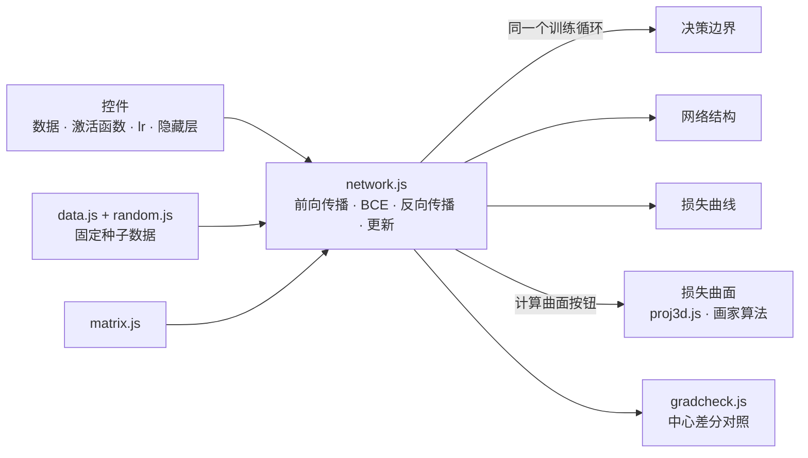

# NeuralVisualizer

<p align="center"></p>

> 不借助任何外部库，从矩阵运算、反向传播到3D 投影全部亲手实现，在浏览器中用四种视图展示多层感知机学习过程的教学工具「NeuralViz」

---

## 1. 项目概述 (Overview)

| 项目 | 内容 |
|---|---|
| 项目名称 | NeuralVisualizer（应用名「NeuralViz」） |
| 一句话概述 | 改变数据·激活函数·学习率·隐藏层后，决策边界、网络结构、损失曲线、3D 损失曲面会跟随同一个训练循环实时变化 |
| 进行时间 | 2026.09.09 ~ 2026.09.11（v1.0.0 → v1.0.6） |
| 参与人数 | 个人项目 |
| 本人角色 | 设计，神经网络引擎·3D 渲染器·可视化·UI 实现，验证实验 |
| 贡献度 | 100%（仓库的7次提交全部来自本人） |

神经网络课上，反向传播是通过公式学习的。但只看公式，很难亲眼看到为什么需要隐藏层、为什么学习率大了会发散、ReLU 和 sigmoid 的收敛为什么不同。这个工具让人能在屏幕上直接比较这些差异。

之所以一个外部库都不用，是因为这个项目的本质是“亲手实现”。一旦用上张量库，反向传播就只剩一行代码，学到了什么也随之消失。

## 2. 技术栈 (Tech Stack)

| 类别 | 技术 | 选择理由 |
|---|---|---|
| 语言 | Vanilla JavaScript（ES 模块）· HTML · CSS | 无需构建工具，一个 `index.html` 就能打开。不让工具链妨碍“亲手实现” |
| 数值运算 | 自行编写的 `number[][]` 矩阵运算（float64） | 维度不匹配时打印形状并 throw。JS 默认使用 float64，因此可以采用1e-7作为梯度检验标准 |
| 渲染 | Canvas 2D | 3D 也不用 WebGL，而是自行计算旋转·透视投影·朗伯光照·画家算法来绘制 |
| 随机数 | mulberry32 + Box–Muller | 种子相同就会得到相同的数据和初始权重，实验可以复现 |
| 部署 | GitHub Pages | 只有静态文件 |

## 3. 核心功能与负责工作 (Key Features & Contributions)

<p align="center"></p>
<p align="center"></p>
<p align="center"><sub>在本地以 XOR · [4,4] · tanh · lr 0.5 训练1500 epoch 后截取。上：决策边界；下：两个权重方向上的损失曲面与训练路径</sub></p>

### 已实现功能

- **4种数据**：XOR（象限）、圆形、螺旋、两个高斯簇。把线性可分与线性不可分的数据放在一起对比，展示隐藏层的必要性。可以调节噪声。
- **模型设置**：可更改隐藏层激活函数 tanh / ReLU / sigmoid、学习率、隐藏层数和每层神经元数。输出固定为 sigmoid，损失固定为二元交叉熵。初始化方面，tanh·sigmoid 使用 Xavier，ReLU 使用 He。
- **决策边界**：用一次前向传播算出3,600个网格点，涂成热力图。数据点用标签颜色填充并加上白色描边，这样分类正确的点会融入背景，只有分错的点会凸显出来。
- **网络结构**：线条粗细表示权重大小，颜色表示正负号，圆的填充表示偏置。
- **损失曲线**：点数多于宽度时均匀抽稀后绘制。
- **3D 损失曲面**：选取两个参数，在当前值周围用40×40网格扫描，并在其上绘制训练路径。可以拖动旋转查看。
- **梯度验证按钮**：把反向传播得到的梯度与中心差分数值微分对照，显示相对误差。

### 实现的公式

```
前向传播 z[l] = W[l]·a[l-1] + b[l],   a[l] = f(z[l])
损失     J = -(1/m) Σ [ y·log(a) + (1-y)·log(1-a) ]      a 裁剪到 [1e-12, 1-1e-12]
反向传播 δ[L] = a[L] - y
         δ[l] = (W[l+1]ᵀ·δ[l+1]) ⊙ f'(z[l])
         dW[l] = (1/m)·δ[l]·a[l-1]ᵀ,   db[l] = (1/m)·Σ δ[l]
3D       Ry(yaw) → Rx(−pitch) 复合, 透视 s = f / (z + d), 光照 I = 0.35 + 0.65·max(0, n·l)
```

输出层的 delta 之所以简化为 `a - y`，是因为 BCE 的 `∂J/∂a = (a-y) / (a(1-a))` 与 sigmoid 的 `σ'(z) = a(1-a)` 在链式法则中相乘时分母相互抵消。

### 主要工作

- 实现矩阵运算·MLP（前向传播·BCE·反向传播·更新）·数据生成·带种子的随机数
- 梯度检验与 ReLU 拐点判定（见下文问题排查 ①②）
- 3D 投影·法线·朗伯光照·画家算法渲染器
- 四种可视化与控件，接入训练循环，v1.0.6 UI 重构
- 实验（隐藏层与 XOR、学习率、各激活函数的收敛、螺旋数据的容量极限）与整理 README

## 4. 成果与结果 (Results & Metrics)

### 定量成果

| 项目 | 结果 |
|---|---|
| 外部库 | 0个 · 代码约2,800行 |
| 引擎测试（`tests/run.html`） | **5/5通过**（2026.09 重新运行）。tanh 梯度相对误差9.622e-10，ReLU 2.788e-10，sigmoid 1.732e-10 |
| 梯度检验扫描 | 数据4 × 激活函数3 × 层结构7 = 84种组合，重复3次（252例）+ 训练后4例，失败0例，最大相对误差1.2e-8（README 记录。扫描脚本不在仓库中） |
| 3D 验证 | 旋转后长度保持误差8.88e-16，`R(θ)R(-θ) = I` 误差2.22e-16。36种 yaw × 31,408像素中，画家算法的深度反转为0例 |
| XOR 训练 | [2,4,4,1] tanh，2000 epoch 后损失0.0043 · 准确率100%（265ms） |
| 实际课堂·用户使用 | （待确认） |

**各激活函数的收敛**（XOR 200个，[2,4,4,1]，lr 0.5，2000 epoch，种子1~8的中位数）

| 激活函数 | 达到损失 < 0.1 | 达到时的 epoch | 最终损失 | 准确率 |
|---|---|---|---|---|
| tanh | 8/8次 | 226 | 0.0043 | 100% |
| ReLU | 7/8次 | **162** | 0.0105 | 100% |
| sigmoid | **0/8次** | — | 0.3040 | 87.0% |

ReLU 最快，但8次中有1次因死亡单元而没能达到标准。sigmoid 的导数最大值为0.25，经过两个隐藏层后梯度会缩小到十六分之一以下，因此一次也没能达到标准。

### 定性成果

- **2D 和 3D 用不同的语言展示同一个事实。** 去掉所有隐藏层来训练 XOR 时，损失停在0.6849（ln 2 ≈ 0.6931 附近），准确率为49.5%。在决策边界上，表现为一条直线在点之间徘徊；在损失曲面上，则是一个最低点为0.6852、与当前损失几乎相同的平坦碟形。结合曲面来看，“再跑下去也没用”就一目了然了。
- **测量了螺旋数据中哪部分最先被解开。** 用 `[6,6]` tanh 在5,370 epoch 时达到94.5%。按半径区间来看，外侧在500 epoch 时就已达到81%，最先理顺；中间带直到2000 epoch 仍停留在20%多，最慢。两条旋臂之间的间距是固定的，但越往内曲率越大，几个隐藏单元所能构造的弯曲不够用。20%多并不意味着分不出来，而是说明它恰好反着分对了。
- **不是凭“看起来”，而是凭“测量”来验证。** 以字节为单位比较了重构前后的输出，神经元圆圈的重叠则通过扫描 canvas 的 alpha 通道按像素测量（`[2,8,8,1]` 在280px 内直径26px，最小间距3px）。

### 已知局限

- **损失曲面是二维截面。** 只改变选中的两个参数，其余参数固定为当前值。实际训练中其余参数也会一起变化，因此曲面上的路径只是近似。
- **训练充分进行之后，梯度验证可能超出标准。** 写报告时，以 XOR · [4,4] · tanh 训练1500 epoch 后按下验证按钮，相对误差为2.8e-7，超过标准（1e-7），显示为“失败”。看起来是损失降到0.005左右后梯度本身变小，浮点舍入在相对误差中所占的比重随之变大（推测，待确认）。需要结合绝对误差来判断，或按梯度大小调整 ε 加以补充。
- **252例扫描没有复现途径。** 仓库中留下的测试只有5项。只有把扫描脚本一并提交，其他人才能核实 README 中的数值。
- **画家算法依赖高度场这一前提。** 如果扩展到有悬垂结构的形状，就需要 z 缓冲或单元分割。

## 5. 问题排查经验 (Troubleshooting)

### ① 只有 ReLU 未通过梯度检验

**问题** tanh 和 sigmoid 以1e-10量级的相对误差通过，只有 ReLU 以2e-2失败。

**原因** 问题不在反向传播，而在数值微分一侧。ReLU 在 `z = 0` 处不可导。把偏置初始化为0后，前一层输出全为0的死亡单元，其 z 恰好为0。在这一点上，中心差分会跨越拐点，把左导数0和右导数1取平均，因此数值梯度本身就是错误的值。通过对照实验确认了这一点：扫描30个种子后，`min|z| = 0` 的17例全部失败，`min|z| > 0` 的13例全部通过，没有例外。

**解决** 在检验之前先判定“该点是否离拐点足够远”。若该点落在拐点上，就换到没有拐点的种子重新测量，并把这一情况写到界面和日志中。

**结果** 只挑离拐点足够远的点测量时，相对误差降到1e-8~1e-10量级。测试日志中也原样留下“种子3的点落在拐点上 → 换到无拐点的种子1重新检验 → 2.788e-10 通过”。

### ② 拐点判定过于乐观

**问题** 加入判定之后，252例中仍有2例以最大相对误差5.17e-4失败。

**原因** 最初的判定只考虑了“参数扰动 ε 时，下一层的 z 最多移动 `ε·max|a|`”。然而前面层产生的扰动越往后传，就越会按权重被放大。

**解决** 改为逐层累积扰动的上界。

```
R[l] = ‖W[l]‖∞ · R[l-1] + ε · max(|a[l-1]|, 1)
```

这是利用 tanh·sigmoid·ReLU 导数绝对值都不超过1这一性质得到的 Lipschitz 上界。只要每一层都满足 `min|z| > R[l]`，无论扰动哪个参数都不会越过拐点。

**结果** 剩下的2例失败消失了。我刻意没有采用“失败了就重新抽种子，一直跑到通过为止”的办法。那种办法即使存在真正的反向传播 bug，也会碰巧找到能通过的点，使验证失去意义。先判定测量点是否有效，并把它与结果分开，通过的结果就值得信赖，落在拐点上这一事实也不会被掩盖。

### ③ 没有 z 缓冲，3D 曲面能否正确遮挡

**问题** 要用 Canvas 2D 绘制损失曲面，就必须处理被遮挡的面。按像素实现 z 缓冲既慢，代码量也大。

**原因** 对于一般形状，可能出现单元 A 遮挡 B、同时 B 又遮挡 A 的循环重叠，因此只按单元排序并不安全。

**解决** 利用了这样一点：该曲面是从上方俯视网格上的高度场，不可能出现循环重叠。按单元四个顶点的平均深度降序排序，从远处的单元开始绘制（画家算法）。这一前提是否成立，通过实测加以确认：在36种 yaw 下，对31,408个像素逐一比较画家算法的结果与用重心插值求得的实际最近单元。

**结果** 深度反转0例。“每个单元用一个代表值即可构成全序”这一前提在该形状上成立。

## 6. 链接与交付物 (Links & Deliverables)

| 类别 | 链接 |
|---|---|
| GitHub 仓库 | [stx4R/NeuralVisualizer](https://github.com/stx4R/NeuralVisualizer)（私有） |
| 部署网址 | https://stx4r.github.io/NeuralVisualizer/ |
| 引擎测试 | 仓库中的 `tests/run.html`（用静态服务器打开，查看控制台） |

### 结构



| 文件 | 作用 |
|---|---|
| `src/matrix.js` | 矩阵运算。维度不匹配时打印形状并 throw |
| `src/network.js` | MLP 主体 |
| `src/gradcheck.js` | 比较数值微分与解析梯度的相对误差 |
| `src/proj3d.js` | 3D 旋转·透视投影·法线·朗伯着色（纯函数） |
| `src/viz-*.js` | 决策边界 · 网络结构 · 损失曲线 · 损失曲面 |
| `src/main.js` | 控件·训练循环·视图切换 |

---

+++

## 客户旅程图 (Journey Map)

用户是初学神经网络的学生。

| 阶段 | 用户的行为 | 用户的想法 | 工具的应对 |
|---|---|---|---|
| 开始 | 选择 XOR 并点击播放 | “什么东西在动？” | 决策边界的颜色逐渐晕开，损失曲线下降 |
| 实验1 | 去掉所有隐藏层 | “为什么不行？” | 损失停在0.69，曲面是平坦的碟形 |
| 实验2 | 把学习率提高到3.0 | “应该会更快吧？” | 损失曲线在0.3~0.8之间锯齿状跳动 |
| 实验3 | 换成 sigmoid | “激活函数有什么不同？” | 同样的设置下，损失下降得慢很多 |
| 确认 | 点击梯度验证 | “这个计算对吗？” | 显示解析梯度与数值梯度的相对误差 |

## 动效设计 (Motion Design)

- 训练过程中，四个视图每帧都跟随同一个训练循环一起变化。决策边界从白色（输出0.5）开始，逐渐分成两种颜色。训练前背景是白色，是因为 Xavier 初始化使权重很小，输出在整个区间都贴近0.5。
- 损失曲面通过拖动旋转（pitch 5°~85°）。只有按下“计算曲面”按钮时才进行计算，因此不会拖慢训练循环。

## 手势设计 (Gesturing)

- 用鼠标或手指拖动损失曲面，可以改变绕竖直轴的旋转（yaw）和倾角（pitch）。把俯视角度限制在5°~85°，避免曲面看起来被翻转。

## 自适应设计 (Adaptive Design)

- v1.0.6 把原本挤在顶部栏中的控件移到左侧卡片（数据 · 模型 · 播放），右侧则放置指标卡片（epoch · 损失 · 准确率 · 梯度相对误差）和四种可视化。
