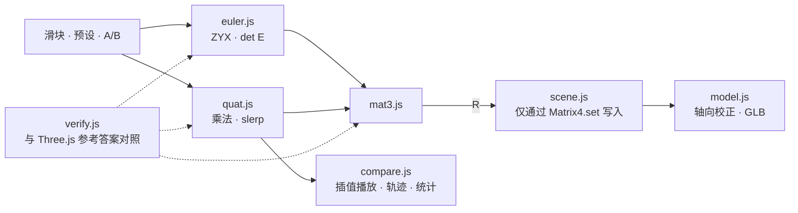

# RotLab

<p align="center"></p>

> 不借助任何库，亲手实现欧拉角、旋转矩阵和四元数，并用 3D 画面和数值同时展示万向节锁及不同插值方式差异的旋转变换实验室

---

## 1. 项目概述 (Overview)

| 项目 | 内容 |
|---|---|
| 项目名称 | RotLab（旋转变换练习工具） |
| 一句话概述 | 把飞机模型装在三个万向节环上旋转，用实测数值展示 θ 接近 ±90° 时自由度消失的过程，以及欧拉线性插值比 slerp 多绕了多远的路 |
| 进行时间 | 2026.09.09（v1.0.0 → v1.1.3，一天） |
| 参与人数 | 个人项目 |
| 本人角色 | 旋转数学实现、验证设计、3D 场景与 UI 实现、测量方法论 |
| 贡献度 | 100%（仓库全部 6 次提交均由本人完成） |

学习旋转时，会依次接触欧拉角、旋转矩阵和四元数。欧拉角直观但存在万向节锁，四元数插值平滑，教科书讲到这里为止。但万向节锁发生时究竟失去了什么，欧拉插值的“不平滑”究竟是速度问题还是路径问题，只有亲手测量才知道。这个工具用数字回答这两个问题。

Three.js 只用于渲染（场景、相机、光照、网格）。**旋转数学部分没有用到一行库代码。** `THREE.Euler`、`THREE.Quaternion`、`Matrix4` 的旋转生成方法只在验证模块中作为参考答案，用来与自己的实现对照。

## 2. 技术栈 (Tech Stack)

| 类别 | 技术 | 选择理由 |
|---|---|---|
| 旋转数学 | Vanilla JavaScript 纯函数（`mat3` · `euler` · `quat`） | 实现本身就是学习目标。为了不与渲染器混在一起，单独拆分了模块 |
| 渲染 | Three.js r185（用 esbuild 打包为单文件，固定在 `vendor/`） | 只负责场景、光照和网格。克隆后无需 `npm install` 即可运行，不依赖 CDN |
| 验证 | 自研验证器 + 以 Three.js 内置旋转为参考答案对照（浏览器 · Node 运行器） | 既然已有独立实现的答案，就可以逐个分量对照 |
| 3D 资源 | GLB 飞机模型（Meshy AI 生成 → 重新网格化） | 将原始的 307 万个多边形减到 26,762 个，纹理也做了压缩 |
| 字体 · 部署 | Pretendard（包含在仓库中） · GitHub Pages | 全部是静态文件 |

## 3. 核心功能与负责工作 (Key Features & Contributions)

<p align="center"></p>
<p align="center">
  
  </p>
<p align="center"><sub>本地截图。上：正常姿态（det E 0.9397，自由度 3）。左下：θ=90° 万向节锁（蓝色 Z 环与橙色 X 环重叠在同一平面，det E 0.0000，自由度 2）。右下：过极点插值结果（欧拉路径超出 +115.90%）</sub></p>

### 已实现功能

- **姿态调节**：用 yaw · pitch · roll 滑块（欧拉模式）或四元数模式旋转机体。三个万向节环（Z 蓝 · Y 绿 · X 橙）分别表示各个轴。
- **仪表盘**：实时显示旋转矩阵 R、角速度映射矩阵的行列式 `det E = cos θ` 以及剩余自由度。`|det E| < 0.05` 时变为警告色。
- **万向节锁演示按钮**：根据 θ 的符号自动选出“构成同一旋转的配对”，以数值给出一致组、对照组、消失方向三项结果。
- **插值对比**：指定 A、B 两个姿态，在 3 秒内并排播放欧拉线性插值（红色）与 slerp（白色）。绘制机头端点的轨迹，并在结果面板中给出每帧旋转角的平均值、标准差、最大值，以及总旋转角和相对测地线的超出率。
- **5 种预设**：正常 · 万向节锁 · 过极点插值 · θ̇·ψ̇·φ̇=0 · 路径失控。点一下对应的标签即可设定姿态或直接播放。
- **验证报告**：点击面板上的 `✓6` 按钮，即可打开在浏览器中直接运行的对照结果。

### 坐标约定与核心公式

世界坐标为 Z-up，机体为 +x 机头 · +z 向上 · +y 左翼，欧拉顺序为 ZYX（yaw ψ → pitch θ → roll φ）。

```
R = Rz(ψ) · Ry(θ) · Rx(φ)
E = [ Rz(ψ)Ry(θ)·e₁ ,  Rz(ψ)·e₂ ,  e₃ ]      ω = E · [φ̇, θ̇, ψ̇]ᵀ,     det E = cos θ
slerp(q₀,q₁,t) = ( sin((1−t)Ω)·q₀ + sin(tΩ)·q₁ ) / sin Ω,   Ω = arccos(q₀·q₁)
```

`matrixToEuler` 没有使用在 θ 接近 ±90° 时条件数急剧恶化的 `asin`，而是使用 `atan2`。矩阵 → 四元数的转换采用 Shepperd 方法，先求四个分量中绝对值最大的那一个。如果先求 w，旋转接近 180° 时精度会崩溃。

### 主要工作

- 自行实现 3×3 矩阵、ZYX 欧拉角、四元数（Hamilton 乘积、轴-角、旋转作用、slerp）
- 设计与 Three.js 内置旋转对照的 6 项验证，编写浏览器与 Node 运行器
- 万向节锁的代数分析与实证演示，插值对比的测量方法论
- 万向节环、轨迹、仪表盘、结果面板 UI，GLB 模型的轴向校正与回退方案

## 4. 成果与结果 (Results & Metrics)

### 定量成果

**与 Three.js 内置实现对照**（Node 运行器，2026.09 重新运行，6 项全部通过）

| # | 项目 | 对照对象 | 样本 | 最大误差 | 阈值 |
|---|---|---|---|---|---|
| 1 | `eulerToMatrix` (ZYX) | `Matrix4.makeRotationFromEuler` | 200 | 2.220e-16 | 1e-12 |
| 2 | `quat.multiply` | `Quaternion.multiply` | 200 | 2.220e-16 | 1e-12 |
| 3 | `toMatrix`/`fromMatrix` 往返 | 自洽性 | 200 | 1.110e-15 | 1e-12 |
| 4 | `quat.rotateVector` | `Vector3.applyQuaternion` | 200 | 8.882e-16 | 1e-12 |
| 5 | `quat.slerp` | `Quaternion.slerp` | 1100 | 3.331e-16 | 1e-9 |
| 6 | `gimbalMeasure` = det E | `cos θ`（解析解） | 200 | 2.220e-16 | 1e-14 |

第 5 项的样本中包含 47/100 个对跖点对（`dot < 0`）。第 6 项还同时确认了 θ=±90° 时 `|det E| = 6.12e-17`。把 400 个随机种子全部跑一遍，失败 0 次，所有项目中的最差误差为 2.442e-15。

**欧拉插值与 slerp 对比**（均匀 t 网格，180 步）

| 案例 | 欧拉标准差 | slerp 标准差 | 欧拉总旋转角 | slerp 总旋转角 | 超出 |
|---|---|---|---|---|---|
| 过极点 (90, −45, 5) → (85, 95, 10) | 0.3186° | 8.37e-15° | 302.647° | 140.177° | **+115.9%** |
| θ̇·ψ̇·φ̇ = 0 (−70, 80, 0) → (100, −80, 0) | 1.24e-14° | — | 233.451° | 178.266° | **+31.0%** |
| 路径失控 (135, 85, 15) → (145, 95, 5) | 1.62e-14° | 5.70e-15° | 339.676° | 22.355° | **+1419.5%（15.19 倍）** |

| 项目 | 结果 |
|---|---|
| 规模 | 旋转数学、验证、场景 JS 约 2,700 行 |
| 3D 模型 | 307 万 → 26,762 个多边形 |
| 实际课堂 · 用户使用情况 | （待确认） |

### 定性成果

- **用三种方式展示了万向节锁。** 数值（det E 在 θ=0° 时为 1，60° 时为 0.5，90° 时为 0）、代数（θ=+90° 时 R 的所有分量都只用 `sin(φ−ψ)`、`cos(φ−ψ)` 表示，两个角合并成一个）、实证（θ=+90° 时 yaw +30° 与 roll −30° 的差为 1.110e-16；同时改变 φ 和 ψ，在 5°~180° 的任何位置姿态都不变）。
- **揭示了欧拉插值有两种失效模式。** 展开角速度大小可得 `|ω|² = ψ̇² + θ̇² + φ̇² − 2ψ̇φ̇·sin θ(t)`，因此三个角速度中只要有一个为 0，欧拉插值也会是完美的匀速。即便如此，路径仍会拉长到测地线的 15 倍。如果只看速度波动（标准差），就会错过最剧烈的那种失效。
- **把校正和旋转数学分离开。** 将 GLB 模型的局部轴转换到应用约定的常量（`MODEL_AXIS_FIX`，det = +1）只放在模型模块这一处，旋转数学模块完全不知道这个文件的存在。从三脚架换成 GLB 之后，万向节锁的实测值（`θ=+90°: 1.110e-16 / 0.9962`）依然没变。

### 已知局限

- **pitch 的符号与航空惯例相反。** 在右手坐标系中，若 x 朝前、z 朝上，则 y 必然朝左，而 `Ry(θ)·(1,0,0) = (cos θ, 0, −sin θ)`，所以 +pitch 时机头朝下。这不是实现失误，而是约定的必然结果。只翻转滑块符号的话，已经测得的数值含义会全部改变，因此保留约定并写入了文档。
- **θ=±90° 时欧拉分解不唯一。** `|cos θ| < 1e-6` 时标记为 `degenerate: true`，并把 φ 固定为 0。
- **恰好相差 ±180° 时插值方向无法确定。** 最短方向有两个，由浮点数的符号决定。A(20, 85, −10) → B(20, 95, −10) 视符号组合不同，欧拉路径可能是 35.97 倍，也可能是 1.57 倍。因此所有预设都与 ±180° 保持 5° 以上的距离。
- **切换模式时姿态最多偏差约 0.9°。** 原因是分解值会按滑块单位取整。插值对比另外以四元数保存，所以不受影响。
- **README 中的三个 GIF 不在仓库里。** README 引用了 `hero.gif` 等文件，但这些文件没有提交，README 里的图片因此无法显示。

## 5. 问题排查经验 (Troubleshooting)

### ① slerp 偶尔会沿远端的弧旋转

**问题** 如果完全照规格中的公式实现四元数 slerp，部分 A、B 组合会绕超过 180° 的远路旋转。去掉符号处理后与 Three.js 参考答案对照，对跖点对的最大误差会扩大到 1.95（阈值 1e-9）。

**原因** 源于四元数的双重覆盖。q 和 −q 表示同一个旋转，但在四维球面上是正好相对的两个点。`dot(q₀,q₁) < 0` 时 q₁ 位于另一侧半球，`Ω = arccos(dot)` 超过 90°，插值就会走远端的弧。

**解决** `dot < 0` 时翻转 q₁ 的符号，选择较短的一侧。两个四元数几乎相同、`dot > 0.9995`（Ω ≈ 1.81°）时，sin Ω 接近 0，除法会失稳，因此改用线性插值后归一化（nlerp）代替。在这一区间内，nlerp 与真正 slerp 的差最大为 6e-5°。另外规定验证样本中只要一个对跖点对都没有就判为失败，防止在根本没检查到这种情况时就通过。

**结果** slerp 对照 1100 个样本的最大误差降到 3.331e-16。这是包含 47 个对跖点对的结果。

### ② 规格里写的万向节锁验证标准是错的

**问题** 最初定的标准是“θ=90° 时 yaw +30° 与 roll +30° 构成同一个旋转”。但实测两个矩阵的差为 0.9962，完全不同。

**原因** 这一表述没有考虑符号。在 θ=+90° 处展开 R，所有分量只取决于 `(φ − ψ)` 这一项。要构成同一旋转，差值必须相同，所以 yaw +30° 的配对是 roll **−30°**。θ=−90° 时则取决于 `(φ + ψ)`，配对的符号再次反转。

**解决** 依据展开式修正了标准，并让万向节锁演示按钮根据 θ 的符号自动选择配对。结果中同时给出一致对、对照组、消失方向三项。

**结果** θ=+90° 时 yaw +30° 与 roll −30° 的差为 1.110e-16（同一旋转），与 roll +30° 的差为 0.9962（不同旋转）。θ=−90° 时结果恰好相反。不是让规格迁就代码，而是用数学修正了规格。

### ③ 只看标准差会漏掉最大的失效

**问题** 原本打算用“每帧旋转角的标准差”来说明欧拉插值的缺陷。但在路径失控案例 (135, 85, 15) → (145, 95, 5) 中，欧拉与 slerp 的标准差都在 1e-14 量级，无法区分。

**原因** 展开角速度大小后，随时间变化的只有 `−2ψ̇φ̇·sin θ(t)` 这一项。这个案例两端的 θ 都分解为 85°，θ̇ = 0，所以欧拉插值也是完美的匀速。但路径严重弯曲，slerp 转 22.4° 的同时欧拉要转 339.7°。

**解决** 在指标中加入了总旋转角和相对测地线的超出率，测量方法也做了改进。渲染 Δt 的抖动会同等地混入两种方式并掩盖差异，所以改用均匀 t 网格做统计。播放的首帧和末帧在结构上属于不完整帧，因此从统计中剔除。剔除前 slerp 标准差为 0.0493°，原因是 180 个样本中的一个异常值，剔除后为 1.06e-14°。实际渲染帧的统计注明这一点后另行列出。

**结果** 结果面板把“速度波动”和“路径失控”分开展示。路径失控表现为 +1419.5%，即 15.19 倍。

### ④ 小角度下旋转角公式失效

**问题** 用旋转矩阵的迹（`α = arccos((tr − 1)/2)`）计算每帧旋转角时，在 A 与 B 几乎相同的播放中数值会出错。

**原因** `arccos` 的导数在输入接近 1 时发散。迹公式相当于把 `1 − α²/4` 代入 `arccos`，α 越小误差越大。先用轴-角精确构造真值再测量，0.0001° 时相对误差为 1.7e-4，0.000001° 时为 1.0（返回 0）。

**解决** 改用两个姿态的相对四元数来测量：`q_rel = q_t ⊗ conj(q_{t−1})`，`α = 2·atan2(‖(x,y,z)‖, |w|)`。由于使用了 `|w|`，双重覆盖问题也随之自然解决。

**结果** 在 A≈B（0.005°）的播放中，最大相对误差分别为迹公式 3.10e-3、四元数公式 1.01e-9。大角度下两个公式在机器精度内一致，因此更换公式后原有数值没有变化。

## 6. 链接与交付物 (Links & Deliverables)

| 类别 | 链接 |
|---|---|
| GitHub 仓库 | [stx4R/RotLab](https://github.com/stx4R/RotLab)（非公开） |
| 部署网址 | https://stx4r.github.io/RotLab/ |
| 验证 | `npm install && npm run verify`（Node） · `tests/run.html`（浏览器控制台） · 应用内的 `✓6` 按钮 |

### 结构

```
payload (Group)     ← 旋转数学算出的 R 直接放进这里
  └ fixed (Group)   ← MODEL_AXIS_FIX · 缩放 · 中心平移。常量，只应用一次
       └ GLB 场景     （加载失败时自动回退到三脚架模型，并在画面上提示）
```



---

+++

## 客户旅程图 (Journey Map)

用户是正在学习 3D 旋转的学生。

| 阶段 | 用户行为 | 用户想法 | 工具的响应 |
|---|---|---|---|
| 探索 | 把 yaw 滑块推到底 | “环为什么各转各的？” | 只有外侧的 Z 环自转，内侧的环和机体被带着一起转 |
| 发现 | 点击“θ 设为 90°”按钮 | “说的锁住到底是什么？” | 两个环重叠在同一平面，det E 变为 0.0000，自由度降到 2 |
| 确认 | 点击万向节锁演示 | “真的是同一个旋转吗？” | 用数字给出 yaw +30° 与 roll −30° 的差 1.110e-16 |
| 对比 | 播放过极点插值预设 | “四元数到底好在哪？” | 红色轨迹绕了一大圈，结果面板显示超出 +115.9% |
| 质疑 | 打开 `✓6` 验证报告 | “这个计算可信吗？” | 显示刚刚在浏览器中运行的 6 项对照的误差 |

## 动效设计 (Motion Design)

- 插值播放时，两架机体在 3 秒内并排运动，机头端点留下轨迹线。欧拉为红色，slerp 为白色。
- 播放由 `requestAnimationFrame` 驱动，但在窗口不参与合成的环境中 rAF 不会触发。如果 100ms 内没有触发，就改由定时器推进，并在统计中记录实际的 Δt。
- det E 仪表降到 0.05 以下时变为警告色。

## 手势设计 (Gesturing)

- 拖动 3D 画面可让相机沿轨道旋转，滚轮用于缩放。没有使用 OrbitControls，相机轨道是自己实现的。

## 自适应设计 (Adaptive Design)

- 3D 视图放在左侧宽阔区域，控件和仪表盘放在右侧面板。插值结果以从右侧滑出的面板显示，不会遮挡 3D 视图。
